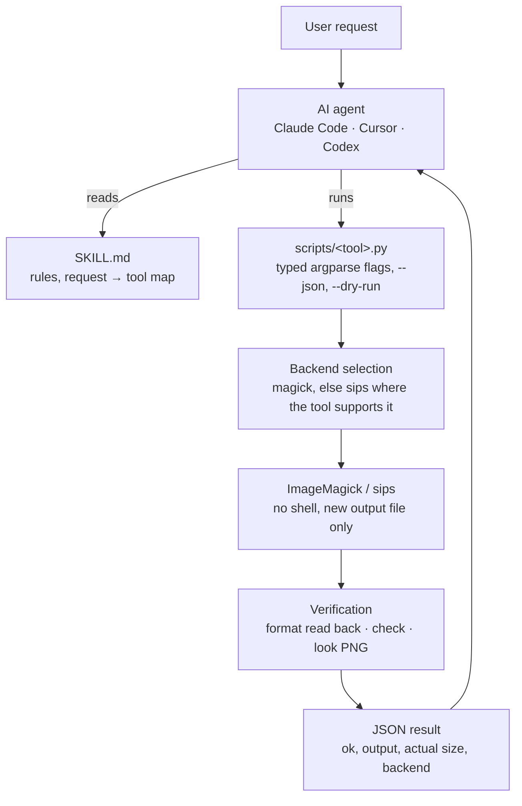
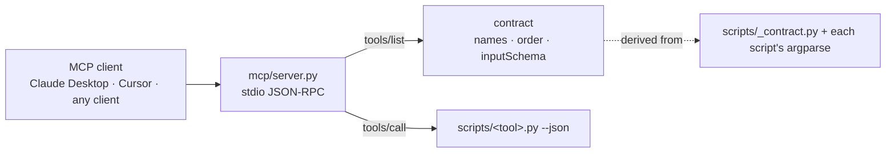

<p align="center">
  
</p>

<h1 align="center">imagemagick-skill</h1>

<p align="center"><strong>Give your coding agent an image editor that never overwrites the original.</strong></p>

<p align="center">
  Local ImageMagick · No cloud · No API keys · Python standard library<br>
  Claude Code · Cursor · Codex · MCP
</p>

<p align="center">
  <a href="https://github.com/kajisho5/imagemagick-skill/actions/workflows/test.yml"></a>
  <a href="https://github.com/kajisho5/imagemagick-skill/actions/workflows/codeql.yml"></a>
  <a href="https://www.npmjs.com/package/imagemagick-skill"></a>
  
  <a href="#imagemagick-compatibility"></a>
  <a href="LICENSE"></a>
</p>

```bash
npx imagemagick-skill
```

<table>
  <tr>
    <td width="50%"><br><sub><code>preset.py --preset og</code> → <code>strip.py</code> → <code>check.py</code></sub></td>
    <td width="50%"><br><sub><code>optimize.py --max-kb 200</code></sub></td>
  </tr>
  <tr>
    <td width="50%"><br><sub><code>compare.py before.png after.png -o heatmap.png</code></sub></td>
    <td width="50%"><br><sub><code>icons.py logo.png -o icons</code></sub></td>
  </tr>
</table>

Every frame is the real output of the command under it, and every number on a frame is read from that command's `--json` result. **[The commands and their JSON results →](docs/demos.md)** The inputs are drawn by ImageMagick in `python3 demos/build.py`, so you can rebuild every frame yourself. No photographs, people or third-party artwork are used.

`imagemagick-skill` is an [Agent Skill](https://docs.anthropic.com/en/docs/agents-and-tools/agent-skills) for Claude Code, Cursor, Codex and any agent that reads `SKILL.md`. It gives the agent a fixed workflow: probe, then edit into a new file, then check, then look. It ships **19 tools** that do the work with ImageMagick, and with macOS `sips` where no ImageMagick is installed. They are aimed at the images that end up in a repository:

- iPhone HEIC photos
- screenshots
- Open Graph and social images
- README assets
- favicons

Every tool is also an MCP tool, and the whole set is described by a machine-readable contract.

If `magick` (or macOS `sips`) and `python3` are on your PATH, it works offline, on images you would rather not upload.

---

**Contents**
[Why](#why) · [Quick start](#quick-start) · [How it works](#how-it-works) · [Design principles](#design-principles) · [Tools](#tools) · [Built for agents](#built-for-agents) · [ImageMagick compatibility](#imagemagick-compatibility) · [Install](#install) · [Scope](#scope) · [Development](#development) · [Docs](#docs) · [kajisho5 media skills](#kajisho5-media-skills)

---

## Why

An agent that "knows ImageMagick" still guesses. It runs `mogrify` and replaces the only copy of a photo. It resizes to 1200x630 with `!` and squashes the picture. It publishes an iPhone photo with the home address still in its EXIF. It says "done" without opening the file it wrote. This skill takes the guessing out:

- **Originals are never touched.**
  - Every tool that writes needs `-o`.
  - A tool refuses an output that resolves to its input.
  - A tool refuses an existing file unless `--overwrite` is given.
  - `mogrify` is never used.
- **Structured tools, not shell strings.**
  - Each operation is a script with typed arguments, and nothing runs through a shell.
  - Text overlays are rendered literally: `%`, `\` and a leading `@` cannot reach ImageMagick's own escapes.
- **Measured, then verified.**
  - `probe` reads the real size, format, alpha and GPS before anything happens.
  - With ImageMagick, every write is read back to confirm the format.
  - `check` confirms the promised dimensions.
  - `look` renders a PNG for the agent to open.
- **The agent does not design.**
  - Sizes, crops, colours, file-size budgets and adjustment values come from the user.
  - Named platform sizes (`preset.py`) are used only when the user names the platform.
- **Local.** No cloud, no API keys, no pip packages.

## Quick start

```bash
# 1. install the skill for Claude Code (Cursor: --cursor, Codex: --codex, all three: --all)
npx imagemagick-skill

# 2. check the machine: magick / sips, HEIC and WebP support, fonts, which tools can run
npx imagemagick-skill doctor

# 3. (for agent frameworks) the machine-readable contract
npx imagemagick-skill contract --json | head -40
```

Already installed? Re-run `npx imagemagick-skill` to refresh the copy; copies are not updated automatically.

Then talk to your agent:

> "Make `hero.heic` a 1200×630 OG image as WebP and remove the location data. Keep the original."

The agent runs these steps in order, then reports the result with the sheet it looked at:

1. `probe.py hero.heic` reads the real size and finds `has_gps: true`.
2. `preset.py --preset og --mode fill` writes the 1200×630 WebP.
3. `strip.py` removes the GPS.
4. `check.py --expect-width 1200 --expect-height 630 --expect-format webp` confirms the result.
5. `look.py` renders a preview sheet.

More requests it is built for:

> "Get `screenshot.png` under 200 KB for the README without shrinking it."
> → `optimize.py --max-kb 200`. If the budget can't be met, it fails and names the smallest size it reached.

> "`logo.png` から favicon 一式を作って。"
> → `icons.py` writes favicon.ico (16/32/48), PNG icons and apple-touch-icon.png, plus the `<link>` tags.

> "Did the re-export change anything visible?"
> → `compare.py`: SSIM, PSNR, the share of changed pixels, and a heatmap.

> "Put our logo in the bottom-right corner at 20 % width."
> → `overlay.py --image logo.png --position southeast --scale 0.2 --margin 24`.

> "Make this 16:9 without cropping. What colour should the bars be?"
> → the agent asks, because the colour is the user's choice. Then it runs `pad.py --aspect 16:9 --color <yours>`.

The tools also work on their own, from any shell:

```bash
S=~/.claude/skills/imagemagick-skill/scripts
python3 $S/probe.py photo.heic --json
python3 $S/preset.py photo.heic -o og.webp --preset og --mode fill --dry-run   # print the plan, write nothing
python3 $S/preset.py photo.heic -o og.webp --preset og --mode fill --json
python3 $S/strip.py og.webp -o og-clean.webp --json
python3 $S/check.py og-clean.webp --input photo.heic --expect-width 1200 --expect-height 630 --expect-format webp --json
python3 $S/look.py photo.heic og-clean.webp --pair -o look.png --json
```

On Windows, a python.org install exposes `python` (or the `py` launcher) rather than `python3`.

## How it works



Over MCP the same scripts are reached through a transport with no tool table of its own:



## Design principles

1. **Non-destructive.**
   - Output is always a new path.
   - The input is only read, and a test hashes inputs after every tool runs.
   - A multi-frame input (HEIC bursts, ICO, TIFF pages) is read as its first frame. Nothing is animated or split.
2. **Probe first, check last, then look.** SKILL.md makes the agent `probe` before editing and `check` after writing. When the picture changed, it runs `look` and opens the PNG before saying it is done.
3. **Plan before writing.**
   - Every writing tool takes `--dry-run`, which prints the exact backend command and writes nothing.
   - Every tool takes `--json`. Malformed arguments also come back as `ok:false` JSON.
4. **The user decides.**
   - No default target size, crop box, pad colour, file-size budget or adjustment value is invented.
   - `adjust.py` has no "auto" mode.
   - `preset.py` sizes are published platform sizes, each with its source URL. The agent uses them only when the user names that platform.
5. **Refuse instead of quietly doing something else.**
   - `trim` refuses to trim a whole image away.
   - `crop` refuses a rectangle outside the image rather than clipping it.
   - `optimize` fails with the smallest size it reached rather than writing an over-budget file.
   - `icons` refuses a non-square source.
6. **Verify every write.** With ImageMagick, the output is read back after writing and its real format compared with the extension. An ImageMagick build that silently writes PNG bytes into `out.webp` is caught.
7. **Unknown is not false.** GPS detection parses the EXIF block itself, because ImageMagick 6 does not parse a HEIC's EXIF. When the block cannot be parsed, `probe` says so, and `strip` deletes its output rather than claim it is clean.
8. **Capability detection.** `doctor` reports what this machine can run:
   - which backend is present
   - whether HEIC and WebP can be read and written
   - which fonts cover Latin and CJK text
   - a per-tool `usable` answer

## Tools

19 tools, all Python 3.9 standard library, all with `--help`, `--json` and a non-zero exit with a reason on failure. Every tool that writes a file also has `--dry-run` and `--overwrite`. The **sips** column says what still works on a Mac without ImageMagick.

**Inspect and verify**

| Tool | What it does | sips |
|---|---|---|
| `probe.py` | Width, height, format, colorspace, alpha, GPS presence (read from the EXIF block itself) | ✓ |
| `check.py` | Output opens, matches the promised width/height/format, and is not the input | ✓ |
| `look.py` | Labelled preview sheet of one or more images, or `--pair` before/after, as a PNG to open | – |
| `compare.py` | SSIM (pure Python, matches scikit-image), PSNR and changed-pixel share of two same-size images. `-o` writes a heatmap and `--fail-below` gates on SSIM | – |

**Size and geometry**

| Tool | What it does | sips |
|---|---|---|
| `convert.py` | Change format: HEIC→JPEG/PNG/WebP, PNG→WebP, … | ✓ |
| `resize.py` | `fit` (default, no distortion), `fill` (cover, then centre-crop), `exact` (forced) | fit |
| `thumb.py` | Thumbnail by the long edge, aspect kept, never upscales | ✓ |
| `crop.py` | Exact rectangle, or the largest `--aspect W:H` region placed by `--gravity`. Never clips silently | centred aspect |
| `pad.py` | Pad to an `--aspect` or exact canvas with a required `--color` (`none` = transparent). Never scales | centred, `#RRGGBB` |
| `rotate.py` | Clockwise `--degrees`, mirror, or no flag to bake EXIF orientation into the pixels | one 90° step or flip |
| `preset.py` | Named published sizes (`og`, `instagram-*`, `youtube-thumbnail`, `pinterest-pin`, …) with `--mode fill\|fit\|pad`. `--list` shows sizes and source URLs | fill, fit |

**Encode and metadata**

| Tool | What it does | sips |
|---|---|---|
| `optimize.py` | Fit a file-size budget (`--max-kb`) by searching quality, at the same pixel size. Fails with the smallest size reached | JPEG, HEIC |
| `strip.py` | Remove GPS/EXIF, baking orientation first. Refuses an output that still has GPS | – |
| `trim.py` | Trim a solid border. Fails instead of over-trimming | – |

**Compose**

| Tool | What it does | sips |
|---|---|---|
| `overlay.py` | A logo (`--image`, `--scale`) or one line of literal text at a `--position`, with `--margin` and `--opacity`. Japanese text gets a CJK font | – |
| `adjust.py` | Explicit levels, brightness, contrast, saturation, blur and sharpen. No "auto" | – |
| `montage.py` | Row or `--cols` grid with a required `--background`, `--gap` and `--labels` | – |
| `icons.py` | favicon.ico (16/32/48), PNG icons (32/192/512), apple-touch-icon.png, plus the `<link>` tags and manifest entries | – |

**Folders**

| Tool | What it does | sips |
|---|---|---|
| `batch.py` | Run a tool over every image in a folder:<br>• per-file tools write one output each<br>• `look`/`montage` write one sheet<br>• `icons` writes one folder per image<br>• `compare` pairs files with `--against DIR` | as the tool |

Not tools, but part of the surface: `scripts/_contract.py` (`contract --json`, `doctor`) and `mcp/server.py` (the MCP transport).

## Built for agents

### Machine-readable contract

```bash
npx imagemagick-skill contract --json    # or: python3 scripts/_contract.py contract --json
```

For every tool, the contract states:

- its `input_schema`
- its `output_schema`, with required and optional keys
- its `role` (`analysis`, `execution` or `verification`)
- which backends can run it
- how the result is verified
- the shared failure and dry-run shapes

`contract_version` (1.0) is separate from the package version.

The `input_schema` is never written by hand. It is derived at run time from the same `argparse` parser that defines the CLI: flags, types, enums, defaults, required, positional order and mutually exclusive groups. The same pattern is used in [ffmpeg-skill](https://github.com/kajisho5/ffmpeg-skill), where it is called SPEC. A new flag therefore shows up in the contract, in `docs/contract.md` and in MCP `tools/list` without a second edit. A test fails the build if the three disagree. Field-by-field reference: [docs/contract.md](docs/contract.md).

### MCP

`mcp/server.py` is a stdio JSON-RPC server, standard library only, that the installer copies next to the skill. Its tool list, descriptions and input schemas are generated from the contract at start-up.

**Claude Code**

```bash
claude mcp add --scope user imagemagick-skill -- python3 ~/.claude/skills/imagemagick-skill/mcp/server.py
```

**Claude Desktop**

The config file is `~/Library/Application Support/Claude/claude_desktop_config.json` on macOS and `%APPDATA%\Claude\claude_desktop_config.json` on Windows. **Cursor** reads the same `mcpServers` block from `~/.cursor/mcp.json` or `.cursor/mcp.json`:

```json
{
  "mcpServers": {
    "imagemagick-skill": {
      "command": "python3",
      "args": ["/Users/you/.claude/skills/imagemagick-skill/mcp/server.py"]
    }
  }
}
```

On Windows, use `python` instead of `python3` unless Python came from the Microsoft Store.

From a shell:

```bash
python3 ~/.claude/skills/imagemagick-skill/mcp/server.py --list
python3 ~/.claude/skills/imagemagick-skill/mcp/server.py --call probe "{\"input\": \"$PWD/photo.heic\"}"
```

Protocol details:

- **Protocol eras.** The server speaks both: the `initialize` handshake (2024-11-05 through 2025-11-25) and the per-request versioning of 2026-07-28 (`server/discover`).
- **Results.** A call runs the script with `--json` and returns its JSON as `structuredContent` and as text. `ok: false` comes back as `isError: true`.
- **Paths.** Use absolute file paths in arguments.
- **Timeout.** `IMAGEMAGICK_SKILL_MCP_TIMEOUT` bounds each call: seconds, default 600, `0` for none.

### Capability detection

```bash
npx imagemagick-skill doctor          # human-readable
npx imagemagick-skill doctor --json   # backend, heic/webp read+write, fonts, per-tool usable
```

`doctor` reads `magick -version` and `-list format`, or detects `sips`, and resolves every tool against them. Two things are answered separately:

- whether the machine is `ok` overall
- whether a given tool can run, from the `tools` field

A Mac with only `sips` is `ok`, but `strip`'s `usable` is no. Whether a Homebrew or apt build can read and write HEIC depends on how it was linked, so run `doctor` rather than trusting any README (this one included).

## ImageMagick compatibility

Python 3.9+ standard library only, plus one of the builds below. On every pull request, CI runs the full suite against:

| Backend | Where | Notes |
|---|---|---|
| ImageMagick 6.9 | Ubuntu 24.04 apt, Python 3.9 and 3.13 | No `magick` command: the tools use IM6's own `convert`/`identify` (doctor reports `kind: imagemagick6`). HEIC comes from the libheif plugins. |
| ImageMagick 7.1 | macOS, Homebrew | `magick`, HEIC and WebP |
| sips | macOS, no ImageMagick | the reduced tool set in the table above |
| none | Ubuntu, no image binary | Everything that needs no binary: contract, docs drift, installer, MCP protocol, argument errors |

Differences between the builds that CI has already caught, and how the tools deal with them:

- **SSIM.** ImageMagick 6 has no SSIM metric, so `compare.py` computes SSIM itself in Python. It gets the same number on every build and matches scikit-image to 1e-12.
- **WebP quality.** Ubuntu's ImageMagick 6 ignores `-quality` for WebP. `optimize.py` notices that the sizes do not move and switches to `webp:target-size`.
- **HEIC EXIF.** ImageMagick 6 does not parse a HEIC's EXIF, so GPS is read from the raw EXIF block.
- **Grey images.** ImageMagick 7 writes an all-grey result as a one-channel PNG, so the tests read colour through `-colorspace sRGB`.

## Install

```bash
npx imagemagick-skill              # Claude Code → ~/.claude/skills/imagemagick-skill
npx imagemagick-skill --cursor     # Cursor      → ~/.cursor/skills/imagemagick-skill
npx imagemagick-skill --codex      # Codex       → ~/.agents/skills/imagemagick-skill
npx imagemagick-skill --all        # all three
npx imagemagick-skill --project    # this project → ./.claude/skills/imagemagick-skill
npx imagemagick-skill --dir ./my-skills
npx imagemagick-skill --uninstall  # remove from the default target (add --cursor / --codex / --all for the others)
```

As a Claude Code plugin (no Node needed; this repository is its own marketplace):

```bash
claude plugin marketplace add kajisho5/imagemagick-skill
claude plugin install imagemagick-skill@imagemagick-skill
```

Without Node or the plugin system, clone this repository and copy `SKILL.md`, `scripts/` and `mcp/` into your agent's skills folder.

**Renamed from `image-skill`.** The npm package `image-skill` is an unrelated project by another author, and `npx image-skill` does not install this skill. Installing `imagemagick-skill` removes an old `image-skill` copy of *this* project from the same skills folder, but only when its contents prove it came from this repository. Anything else is left in place with a warning.

ImageMagick itself:

| OS | Command |
|----|---------|
| macOS | `brew install imagemagick` (without it, `sips` covers the reduced tool set) |
| Ubuntu / Debian | `sudo apt install imagemagick libheif-plugin-libde265` (the second package is for HEIC input) |
| Windows | the installer from [imagemagick.org](https://imagemagick.org/script/download.php#windows), with `magick` on PATH |

Ubuntu and Debian ship ImageMagick 6, which has no `magick` command. The tools then use its `convert` and `identify` directly, with no shim; `doctor --json` reports `backends.magick.kind: "imagemagick6"`. A `convert` that is not ImageMagick 6, and any `convert` on Windows, is never used.

Requirements:

- Python 3.9+
- ImageMagick 7 (`magick`) or 6 (`convert`), or on macOS `sips` for the reduced set
- Node 16+ only for the `npx` installer

## Scope

This skill is for still images. It does **not** do:

- video, GIF animation or frame extraction (use [ffmpeg-skill](https://github.com/kajisho5/ffmpeg-skill))
- face recognition
- generative or AI editing
- AI or cloud background removal
- RAW development
- print ICC colour management

A multi-frame input is read as its first frame.

## Development

```bash
python3 -m unittest discover -s tests -v   # tests needing magick/sips skip themselves when absent
python3 .github/scripts/contract_md.py --check   # docs/contract.md matches contract --json
python3 demos/build.py                      # rebuild docs/demos/*.gif, docs/demos.md and assets/logo.png (dev only)
python3 evals/run.py --list                 # the agent eval prompts (see evals/README.md)
node bin/install.js --dir /tmp/skills       # try the installer without touching ~/.claude
```

`demos/build.py` needs ImageMagick. For the HEIC source it also needs `heif-enc` or a HEIC-writing ImageMagick. The skill itself never needs either of those or ffmpeg.

**Releasing is automated.** When a PR merges to `main`, `.github/workflows/release.yml` works out the version from the labels of the PRs merged since the last tag:

| Labels | Release |
|---|---|
| `feature`, `minor` or `enhancement` | minor |
| `fix`, `patch` or `bug` | patch |
| no label | patch |
| only `chore`, `ci`, `docs`, `test`, `refactor` or `dependencies` | none |
| `major` or `breaking` | refused (a major release is a deliberate hand-made bump) |

The workflow then:

1. bumps `package.json`, `.claude-plugin/plugin.json` and `docs/contract.md`
2. writes the `CHANGELOG.md` section
3. tags the release and publishes a GitHub Release
4. publishes to npm with provenance, when an `NPM_TOKEN` secret exists

The details are in [CONTRIBUTING.md](CONTRIBUTING.md).

## Docs

| | |
|---|---|
| [SKILL.md](SKILL.md) | what the agent reads: rules, request → tool map, report format |
| [docs/contract.md](docs/contract.md) | the contract field by field, MCP mapping, every tool's arguments and output keys |
| [docs/demos.md](docs/demos.md) | every demo GIF with the exact commands and their JSON results |
| [docs/design-decisions.md](docs/design-decisions.md) | behaviour that looks like a bug but is a decision, each with the test that pins it |
| [docs/roadmap.md](docs/roadmap.md) | what is done, planned and only an idea |
| [CONTRIBUTING.md](CONTRIBUTING.md) | scope, setup, tests, labels and releases |
| [AGENTS.md](AGENTS.md) | notes for coding agents working on this repository |
| [evals/README.md](evals/README.md) | agent prompts and how they are graded |
| [CHANGELOG.md](CHANGELOG.md) | what changed in each release |

## kajisho5 media skills

The same approach (typed local tools, a JSON contract, originals kept, verify before "done") for other media:

| Skill | For | Install |
|---|---|---|
| **imagemagick-skill** (this repo) | still images: convert, resize, optimize, metadata, icons, compare | `npx imagemagick-skill` |
| [ffmpeg-skill](https://github.com/kajisho5/ffmpeg-skill) | video and audio: cut, captions, reframe, loudness, delivery checks | `npx ffmpeg-skill` |
| [blender-skill](https://www.npmjs.com/package/blender-skill) | 3D: a Blender asset pipeline for coding agents | `npx blender-skill` |

## License

[MIT](LICENSE)
