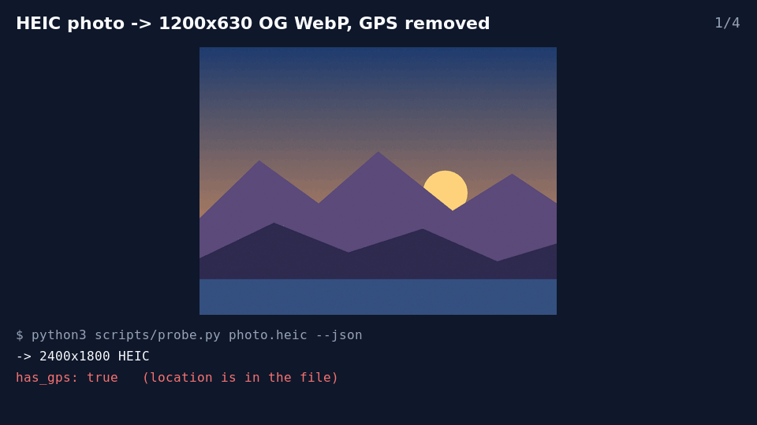
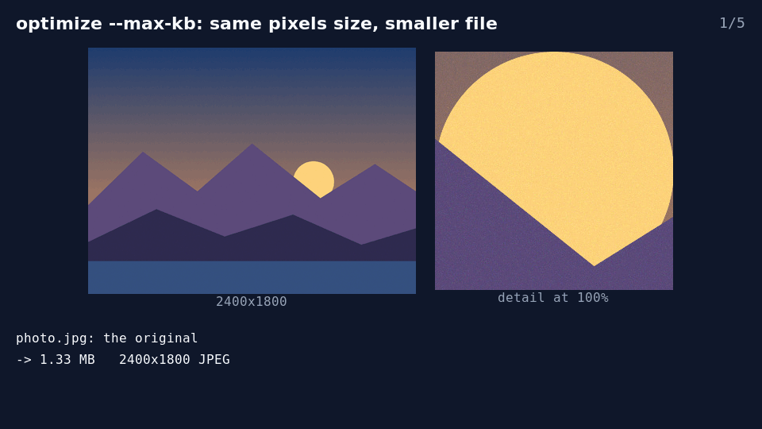
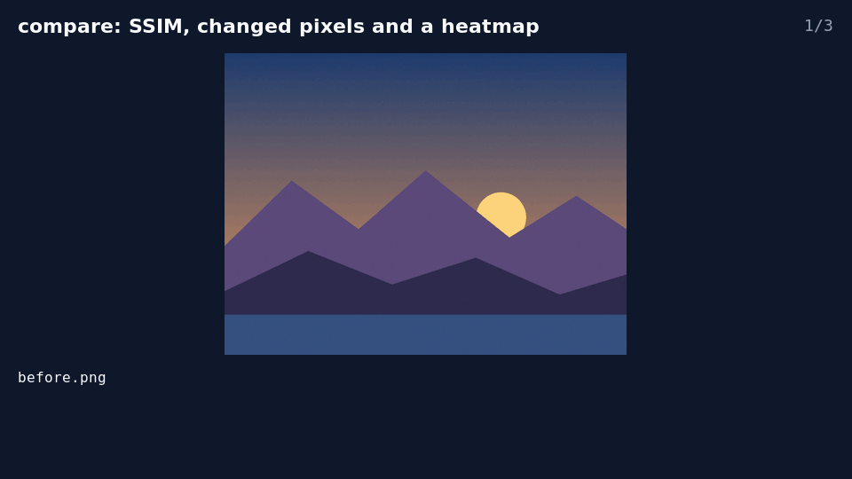
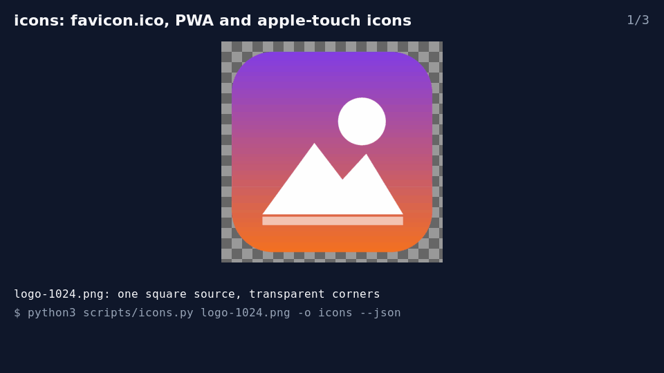

# Demos

Every GIF here is rebuilt by `python3 demos/build.py` (development only: ImageMagick, and
`heif-enc` or a HEIC-writing ImageMagick for the HEIC source). The inputs are drawn by
ImageMagick in that script - a synthetic landscape and a synthetic logo, no photographs, no
people, no third-party artwork - and every number on a frame is read from the `--json`
result of the command shown under it. The results below are from the run that built the
committed GIFs (ImageMagick 6.9.12-98 Q16); another ImageMagick build can land on slightly different
byte counts and qualities.

Shell examples run in the folder that holds the inputs; `scripts/` is the installed skill's
`scripts/` folder (`~/.claude/skills/imagemagick-skill/scripts` after `npx imagemagick-skill`).

## HEIC photo -> 1200x630 OG WebP, GPS removed



```bash
python3 scripts/probe.py photo.heic --json
python3 scripts/preset.py photo.heic -o og.webp --preset og --mode fill --json
python3 scripts/probe.py og.webp --json
python3 scripts/strip.py og.webp -o og-clean.webp --json
python3 scripts/check.py og-clean.webp --input photo.heic --expect-width 1200 --expect-height 630 --expect-format webp --json
```

<details><summary>JSON results</summary>

```json
{"ok": true, "width": 2400, "height": 1800, "format": "HEIC", "colorspace": "sRGB", "has_alpha": false, "has_gps": true, "backend": "magick", "input": "photo.heic"}
{"ok": true, "input": "photo.heic", "output": "og.webp", "preset": "og", "description": "Open Graph / Facebook link-share image", "source": "https://developers.facebook.com/docs/sharing/webmasters/images/", "mode": "fill", "requested": {"width": 1200, "height": 630}, "actual": {"width": 1200, "height": 630}, "via": ["resize"], "backend": "magick"}
{"ok": true, "width": 1200, "height": 630, "format": "WEBP", "colorspace": "sRGB", "has_alpha": false, "has_gps": true, "backend": "magick", "input": "og.webp"}
{"ok": true, "input": "og.webp", "output": "og-clean.webp", "has_gps": false, "backend": "magick"}
{"ok": true, "output": "og-clean.webp", "width": 1200, "height": 630, "format": "WEBP"}
```

</details>

## optimize --max-kb: same pixels size, smaller file



```bash
python3 scripts/probe.py photo.jpg --json
python3 scripts/optimize.py photo.jpg -o photo-400kb.jpg --max-kb 400 --json
python3 scripts/optimize.py photo.jpg -o photo-200kb.jpg --max-kb 200 --json
python3 scripts/optimize.py photo.jpg -o photo-100kb.jpg --max-kb 100 --json
python3 scripts/optimize.py photo.jpg -o photo-56kb.jpg --max-kb 56 --json
```

<details><summary>JSON results</summary>

```json
{"ok": true, "width": 2400, "height": 1800, "format": "JPEG", "colorspace": "sRGB", "has_alpha": false, "has_gps": true, "backend": "magick", "input": "photo.jpg"}
{"ok": true, "input": "photo.jpg", "output": "photo-400kb.jpg", "format": "JPEG", "max_kb": 400.0, "bytes": 390724, "kb": 390.7, "original_bytes": 1330991, "quality": 80, "method": "quality-search", "attempts": [{"quality": 95, "bytes": 1643335}, {"quality": 40, "bytes": 80718}, {"quality": 67, "bytes": 222108}, {"quality": 81, "bytes": 451907}, {"quality": 74, "bytes": 326433}, {"quality": 77, "bytes": 346606}, {"quality": 79, "bytes": 365279}, {"quality": 80, "bytes": 390724}], "stripped": false, "actual": {"width": 2400, "height": 1800}, "backend": "magick"}
{"ok": true, "input": "photo.jpg", "output": "photo-200kb.jpg", "format": "JPEG", "max_kb": 200.0, "bytes": 194160, "kb": 194.2, "original_bytes": 1330991, "quality": 65, "method": "quality-search", "attempts": [{"quality": 95, "bytes": 1643335}, {"quality": 40, "bytes": 80718}, {"quality": 67, "bytes": 222108}, {"quality": 53, "bytes": 122920}, {"quality": 60, "bytes": 154015}, {"quality": 63, "bytes": 171568}, {"quality": 65, "bytes": 194160}, {"quality": 66, "bytes": 212229}], "stripped": false, "actual": {"width": 2400, "height": 1800}, "backend": "magick"}
{"ok": true, "input": "photo.jpg", "output": "photo-100kb.jpg", "format": "JPEG", "max_kb": 100.0, "bytes": 98078, "kb": 98.1, "original_bytes": 1330991, "quality": 47, "method": "quality-search", "attempts": [{"quality": 95, "bytes": 1643335}, {"quality": 40, "bytes": 80718}, {"quality": 67, "bytes": 222108}, {"quality": 53, "bytes": 122920}, {"quality": 46, "bytes": 97602}, {"quality": 49, "bytes": 107532}, {"quality": 47, "bytes": 98078}, {"quality": 48, "bytes": 102897}], "stripped": false, "actual": {"width": 2400, "height": 1800}, "backend": "magick"}
{"ok": false, "reason": "could not get under 56 KB: the smallest result was 80.7 KB at quality 40 - resize first or lower --min-quality", "smallest_bytes": 80718, "smallest_kb": 80.7, "attempts": [{"quality": 95, "bytes": 1643335}, {"quality": 40, "bytes": 80718}]}
```

</details>

## compare: SSIM, changed pixels and a heatmap



```bash
python3 scripts/resize.py photo.jpg -o before.png --width 1200 --height 900 --json
python3 scripts/overlay.py before.png -o after.png --text "DRAFT v2" --position southeast --margin 40 --font-size 64 --color white --opacity 0.8 --json
python3 scripts/compare.py before.png after.png -o heatmap.png --json
```

<details><summary>JSON results</summary>

```json
{"ok": true, "input": "photo.jpg", "output": "before.png", "mode": "fit", "requested": {"width": 1200, "height": 900}, "actual": {"width": 1200, "height": 900}, "backend": "magick"}
{"ok": true, "input": "before.png", "output": "after.png", "kind": "text", "position": "southeast", "margin": 40, "opacity": 0.8, "overlay": {"width": 311, "height": 77}, "font": "/usr/share/fonts/truetype/dejavu/DejaVuSans.ttf", "actual": {"width": 1200, "height": 900}, "backend": "magick"}
{"ok": true, "a": "before.png", "b": "after.png", "width": 1200, "height": 900, "identical": false, "ssim": 0.980518, "ssim_scale": 4, "psnr_db": 29.7818, "diff_ratio": 0.004459, "diff_pixels": 4816, "fuzz": 0.0, "backend": "magick", "output": "heatmap.png"}
```

</details>

## icons: favicon.ico, PWA and apple-touch icons



```bash
python3 scripts/icons.py logo-1024.png -o icons --json
```

<details><summary>JSON results</summary>

```json
{"ok": true, "input": "logo-1024.png", "output_dir": "icons", "files": [{"path": "icons/favicon.ico", "purpose": "favicon", "sizes": [48, 32, 16], "format": "ICO"}, {"path": "icons/icon-512x512.png", "purpose": "png icon", "sizes": [512], "format": "PNG"}, {"path": "icons/icon-192x192.png", "purpose": "png icon", "sizes": [192], "format": "PNG"}, {"path": "icons/icon-32x32.png", "purpose": "png icon", "sizes": [32], "format": "PNG"}, {"path": "icons/apple-touch-icon.png", "purpose": "apple-touch-icon", "sizes": [180], "format": "PNG"}], "html": ["<link rel=\"icon\" href=\"/favicon.ico\" sizes=\"16x16 32x32 48x48\">", "<link rel=\"icon\" type=\"image/png\" sizes=\"32x32\" href=\"/icon-32x32.png\">", "<link rel=\"apple-touch-icon\" href=\"/apple-touch-icon.png\">"], "manifest_icons": [{"src": "/icon-192x192.png", "sizes": "192x192", "type": "image/png"}, {"src": "/icon-512x512.png", "sizes": "512x512", "type": "image/png"}], "backend": "magick", "notes": ["apple-touch-icon.png keeps the source's transparency; iOS shows it on black - pass --apple-background to flatten it"]}
```

</details>
